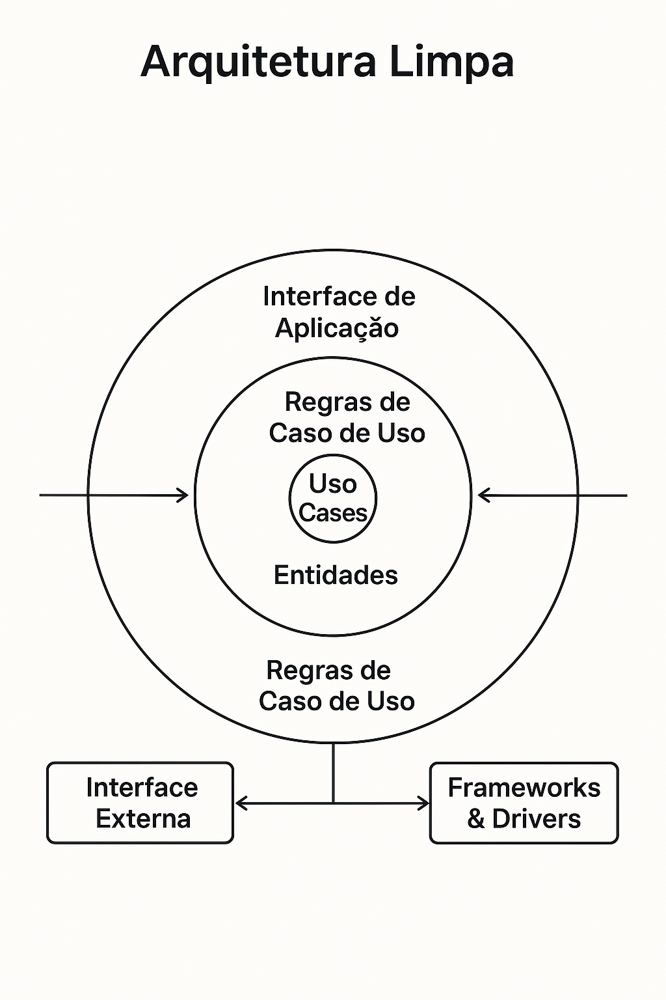

# Microservice Delivery APP

| Name Service | Port Http | Port Https |
| ------------ | ---------| ----- |
| Gateway | 5000 | 5001
| Catalog | 5100 | 5101 |
| Payment | 5200|5201 |
| Notification | 5300 | 9301 |
| Order | 9400 | 9401 |
| IdentityServer | 9500| 9501 |

## Api Gateway Yarp
YARP (Yet Another Reverse Proxy) é uma biblioteca open-source da Microsoft para a criação de reverse proxies altamente personalizáveis em aplicações .NET. Ele permite rotear e balancear cargas entre diferentes serviços de back-end, tornando-se útil para arquiteturas microservices, APIs e aplicações distribuídas.

### Principais Funcionalidades do YARP

* Proxy Reverso – Encaminha requisições HTTP para diferentes servidores de back-end.

* Balanceamento de Carga – Distribui as requisições entre vários servidores conforme estratégias como Round-robin, Least Requests, etc.

* Roteamento Dinâmico – Permite definir regras para redirecionar requisições com base em headers, URLs ou outros parâmetros.

* Reescrita de URL – Modifica URLs antes de encaminhá-las para os serviços de destino.

* Autenticação e Autorização – Pode ser integrado ao ASP.NET Identity e outros sistemas de autenticação.

* Manipulação de Respostas – Personaliza as respostas do back-end antes de enviá-las ao cliente.

* Monitoramento e Logs – Suporta logs detalhados e integração com Application Insights e outras ferramentas de monitoramento.

* Extensibilidade – Pode ser personalizado com middlewares e componentes próprios.

## Catalog Microservice

Esse microservice utiliza:

A Arquitetura Limpa foi proposta por Robert C. Martin (Uncle Bob) e tem como objetivo criar sistemas modulares, testáveis e fáceis de manter, separando regras de negócio da infraestrutura e frameworks.

🎯 Principais Conceitos da Arquitetura Limpa
A Arquitetura Limpa é baseada em camadas concêntricas, onde as dependências sempre apontam para o núcleo da aplicação (regra de negócio).

🔄 Camadas da Arquitetura
1. Entidades (Domínio)
📌 Contém as regras de negócio essenciais da aplicação.
✅ Independente de banco de dados, UI, frameworks e bibliotecas.
👉 Exemplo: Classes de domínio como Cliente, Pedido, Produto.

1. Casos de Uso (Aplicação/Use Cases)
📌 Contém a lógica de aplicação e orquestra as regras de negócio.
✅ Define os serviços que a aplicação deve fornecer.
👉 Exemplo: CadastrarClienteUseCase, ProcessarPagamentoUseCase.

1. Adaptadores (Interface/Drivers)
📌 Camada que expõe os casos de uso via API, UI ou CLI.
✅ Converte dados de entrada para um formato que os casos de uso entendem.
👉 Exemplo: Controllers em uma API REST, interfaces gráficas.

1. Infraestrutura (Frameworks & External Services)
📌 Contém tudo que é externo à aplicação (Banco de Dados, APIs, Mensageria, etc.).
✅ Pode ser substituído sem impactar as regras de negócio.
👉 Exemplo: Repositórios, ORM (Entity Framework, Dapper), provedores de e-mail, gateways de pagamento.

📌 Benefícios da Arquitetura Limpa
* ✅ Facilidade de Manutenção – Código modular e desacoplado.
* ✅ Testabilidade – Possível testar regras de negócio sem depender de infraestrutura.
* ✅ Independência de Frameworks – Troca de tecnologias sem afetar o core.
* ✅ Escalabilidade – Modularização facilita a evolução do projeto.

## Tecnologias e Libs utilizadas  

* **Minimal API** – Implementação leve de APIs no .NET, sem necessidade de Controllers.  
* **Serilog** – Biblioteca para logging estruturado e configurável.  
* **Entity Framework** – ORM para manipulação de banco de dados no .NET.  
* **OpenTelemetry** – Ferramenta para monitoramento e rastreamento de aplicações.  
* **PostgreSQL** – Banco de dados relacional open-source.  
* **Carter** – Extensão para simplificar o desenvolvimento de APIs Minimal no .NET.  
* **Mapster** – Biblioteca de mapeamento de objetos (alternativa ao AutoMapper).  

# Payment Microservice

A Arquitetura de Três Camadas (Three-Tier Architecture) é um modelo arquitetural amplamente utilizado no desenvolvimento de sistemas, que separa a aplicação em três camadas distintas, garantindo modularidade, escalabilidade e manutenção facilitada.

📌 Camadas da Arquitetura
1️⃣ Camada de Apresentação (Presentation Layer)

Responsável pela interface com o usuário (UI).

Pode ser um front-end web (React, Angular, Blazor), uma API REST ou uma interface desktop.

Exemplo: Controllers no ASP.NET, páginas em Razor Pages.

2️⃣ Camada de Aplicação/Negócio (Business Logic Layer - BLL)

Contém a lógica de negócio e regras da aplicação.

Processa dados recebidos da Apresentação e acessa a Camada de Dados.

Exemplo: Serviços, Validadores e Use Cases.

3️⃣ Camada de Dados (Data Access Layer - DAL)

Gerencia o acesso ao banco de dados ou outras fontes de dados.

Utiliza ORM (como Entity Framework) ou repositórios para buscar e manipular informações.

Exemplo: Repositórios e Contextos de banco de dados.

📌 Benefícios da Arquitetura de Três Camadas
* ✅ Separação de responsabilidades – Cada camada tem seu próprio papel bem definido.
* ✅ Facilidade de manutenção – Alterações em uma camada não afetam as outras diretamente.
* ✅ Escalabilidade – Permite distribuir as camadas em diferentes servidores, melhorando a performance.
* ✅ Testabilidade – A lógica de negócio pode ser testada sem depender da interface ou do banco de dados.

🔎 Diferença entre Arquitetura em 3 Camadas e Arquitetura Limpa

Arquitetura 3 Camadas	Arquitetura Limpa
Divide a aplicação em UI, Negócio e Dados	Organiza em Domínio, Aplicação, Infraestrutura e Interface
Camadas são interdependentes	Camadas dependem apenas do Domínio
Mais simples e direta	Mais flexível e adaptável a mudanças

| **Arquitetura 3 Camadas**      | **Arquitetura Limpa**                                 |
|--------------------------------|------------------------------------------------------|
| Divide a aplicação em **UI, Negócio e Dados** | Organiza em **Domínio, Aplicação, Infraestrutura e Interface** |
| Camadas são **interdependentes** | Camadas dependem apenas do **Domínio** |
| Mais **simples e direta** | Mais **flexível e adaptável a mudanças** |

.... under construction
